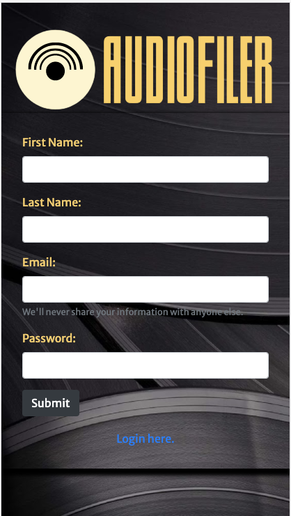

# Project 2: AudioFiler App

    
<h2>

<strong>au·​dio·​phile | \ ˈȯ-dē-ō-ˌfī(-ə)l</strong>
 
<em>noun</em>
 
a hi-fi enthusiast.
 
"AudioFiler is the only catalogging app trusted by audiophiles."

</h2>

AudioFiler is a mobile-first album catalogging application. It allows a user to create an account, search an API for albums, and store those albums within a database to then be returned as the user's collection.

## Motivation

This project was created to provide a virtual library service to users to keep track of their collection of music, including the media type and condition of each album.

## User Story

As a music lover, I would like to have the ability to access and peruse my album collection quickly and easily in a virtual space.

### Mobile

### Desktop

### Link to Deployed Application

<a href="https://blooming-wildwoo
d-71202.herokuapp.com/">Check out AudioFiler deployed on Heroku</a>

## Features

* AudioFiler has a register page, which redirects to a login page, which then redirects to the members or collection page. In the search bar at the top right corner, a user can find an artist, and add any of that artist's albums to their collection page.

* The login and register page features user authentication methods that requires a first name, last name, email address, and a password. The user cannot access the members page without a valid user account.

* If login information is entered incorrectly, the page alerts the user to reenter their information.

* Upon account creation and login, the user is brought to the members page, and their current album collection is displayed.

* The navigation bar at the top of every page features an option to go to the user's collection, or to logout.

* When searching for an artist, each album object displays the album cover art, artist name, album name, release year, and genre. Additionally, there is a notes section, condition select, and checkboxes to select the media type owned.

* When the logout option in the navigation bar is clicked, the user is redirected back to the login page.

## Authors

* Casandra Cutter - Lead on CSS and modeling; assisted with API integration
* Pete Hernandez - Lead on API integration and routing; assisted with client-side JavaScript
* Celine Ross - Lead on handlebars; assisted with styling
* Michael Willingham - Lead on client-side JavaScript and user authentication; assisted with handlebars
* H/t: David Garza
* © 2020 CHRW (Cutter, Hernandez, Ross, Willingham)

## License
ISC
